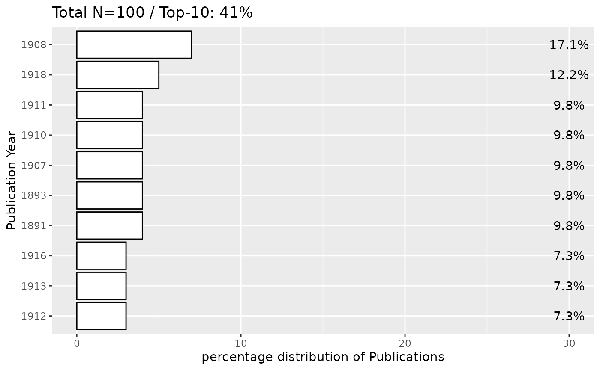

# Fennica in Finna

## Fennica

To search Fennica data in Finna

**N.B** In the search_finna() default limit of 100 records is being
used. Specify ‘limit’ argument for more records.

``` r
library(finna)
fennica <- search_finna("*",filters=c('collection:"FEN"'))
print(fennica)
```

    ## # A tibble: 100 × 10
    ##    id                Title Author Year  Language Formats Subjects Library Series
    ##    <chr>             <chr> <chr>  <chr> <chr>    <chr>   <chr>    <chr>   <chr> 
    ##  1 3amk.39381        Tekn… Markk… 2003  fin      Kirja,… teknolo… 3AMK-k… Edusk…
    ##  2 3amk.55142        Työs… Sanas… 2006  fin      Kirja,… Diction… 3AMK-k… TSK, …
    ##  3 3amk.66893        Mahd… Holma… 2008  fin      Kirja,… Turun a… 3AMK-k… Turun…
    ##  4 ekk.993811934006… Tule… Lampi… 2009  fin      Kirja,… kansain… Edusku… Opetu…
    ##  5 3amk.70767        Kaup… Laine… 2009  fin      Kirja,… kaupunk… 3AMK-k… Tutki…
    ##  6 diana.96117       Suom… Helak… 2011  fin      Kirja,… terveys… Diakon… Rapor…
    ##  7 anders.1286609    Sosi… Niira… 2012  fin      Kirja,… sosiaal… Anders… Acta …
    ##  8 3amk.80687        Kais… Lantt… 2012  fin      Kirja,… Kaisa-t… 3AMK-k… NA    
    ##  9 3amk.86024        Hyvi… Taave… 2015  fin      Kirja,… seksuaa… 3AMK-k… Julka…
    ## 10 3amk.86552        Koko… Sanas… 2014  fin      Kirja,… sanasto… 3AMK-k… TSK, …
    ## # ℹ 90 more rows
    ## # ℹ 1 more variable: last_indexed <chr>

## Bulk data

In order to download the whole data we can add the parameter
`limit = Inf` as
`search_finna("*",filters=c('collection:"FEN"'), limit = Inf)`

## 19th century fennica data

search the whole data and it total search of counts in the the interval
between some years for example between the years 1809-1917 as follows:

``` r
library(finna)
fennica <- search_finna("*",filters = c('collection:"FEN"', 'search_daterange_mv:"[1808 TO 1918]"'))
print(fennica)
```

    ## # A tibble: 100 × 10
    ##    id                Title Author Year  Language Formats Subjects Library Series
    ##    <chr>             <chr> <chr>  <chr> <chr>    <chr>   <chr>    <chr>   <chr> 
    ##  1 aalto.9926263844… Suom… Tie- … 1911  fin      Kirja,… NA       Aalto-… NA    
    ##  2 helka.9915108535… Tiet… Schvi… 1893  fin      Kirja,… arkeolo… Helka-… Suome…
    ##  3 jykdok.724878     Förh… NA     1892  swe      Kirja,… naisasi… Jyväsk… NA    
    ##  4 helmet.1230554    Till… Ekman… 1869  swe      Kirja,… NA       Helmet… NA    
    ##  5 helka.9912014063… Laus… Jutei… 1844  fin      Kirja,… NA       Helka-… NA    
    ##  6 helka.9920831553… Halt… NA     1881  fin      Kirja,… NA       Helka-… NA    
    ##  7 helka.9914651535… Kesä… L. W.… 1898  fin      Kirja,… arkeolo… Helka-… Suome…
    ##  8 jykdok.699840     Luet… Lindb… 1901  fin      Kirja,… NA       Jyväsk… NA    
    ##  9 jykdok.749728     Voly… Neovi… 1893  swe      Kirja,… NA       Jyväsk… NA    
    ## 10 jykdok.750206     Kert… Walli… 1894  fin      Kirja,… NA       Jyväsk… Suome…
    ## # ℹ 90 more rows
    ## # ℹ 1 more variable: last_indexed <chr>

we can check the whole data count

``` r
library(finna)
fennica <- search_finna("*",filters = c('collection:"FEN"', 'search_daterange_mv:"[1809 TO 1918]"'))
result_count <- attr(fennica, "result_count")
print(result_count)
```

    ## [1] 57130

To fetch the whole data using batches of years we can use the
[`fetch_fennica_records()`](../reference/fetch_fennica_records.md)
function as which provides all the fennica data in the given interval
including the `NA` dates and hidden parts

``` r
results <- fetch_fennica_records(
    base_query = "*",
    base_filters = c('collection:"VIO"'), # Filters for the Viola collection
    year_ranges = list(c(1809,1810)),           # Year ranges to query
    include_na = TRUE,                   # Include records with missing dates
    limit_per_query = 100000,              # Maximum records per query
    total_limit = Inf,                 # Overall record limit
    delay_after_query = 3                # Delay between API calls
)
result <- head(results)
print(result)
```

    ## # A tibble: 6 × 10
    ##   id    Title Author Year  Language Formats Subjects Library Series last_indexed
    ##   <chr> <chr> <chr>  <chr> <chr>    <chr>   <chr>    <chr>   <chr>  <chr>       
    ## 1 fikk… Yxin… Molan… 1809  fin      Kirja,… kirkkor… Kansal… NA     NA          
    ## 2 jykd… Kort… Djurb… 1809  swe      Kirja,… Ahvenan… Jyväsk… NA     NA          
    ## 3 fikk… Sång… Granb… 1809  swe      Kirja,… 1800-lu… Kansal… NA     NA          
    ## 4 fikk… De t… Gagar… 1810  swe      Kirja,… travel … Kansal… NA     NA          
    ## 5 fikk… Sång… Wallm… 1809  swe      Kirja,… Suomen … Kansal… NA     NA          
    ## 6 fikk… J. M… Meerm… 1810  deu      Kirja,… NA       Kansal… NA     NA

## Visualization for fennica

We can use any of the functions provided to visualize the data

``` r
library(finna)
fennica <- search_finna("*",filters = c('collection:"FEN"', 'search_daterange_mv:"[1809 TO 1918]"'))
refined_data <- refine_metadata(fennica)
```

``` r
library(finna)
library(ggplot2)
fennica <- search_finna("*",filters = c('collection:"FEN"', 'search_daterange_mv:"[1809 TO 1918]"'))
refined_data <- refine_metadata(fennica)
top_plot(refined_data$Year, field = "Year",  ntop = 10, show.percentage = TRUE) +
  xlab("Publication Year") +  # Custom X-axis label
  ylab("percentage distribution of Publications")  # Custom Y-axis label
```



### Notes:

- **Filters**: The filters need to match the exact field names used in
  Finna’s API. You can find these field names in the API documentation
  or by looking at the response from the API
  [here](https://www.kiwi.fi/display/Finna/Kenttien+mappaukset+eri+formaateista+Finnan+indeksiin).
- **Call Number Search**: Ensure that the call numbers are correctly
  formatted according to the library’s classification system (e.g., [YKL
  in Finland](https://finto.fi/ykl/fi/?clang=en)).

This way, you can extract specific metadata like authors, publication
years, and call numbers using the `search_finna` function.
