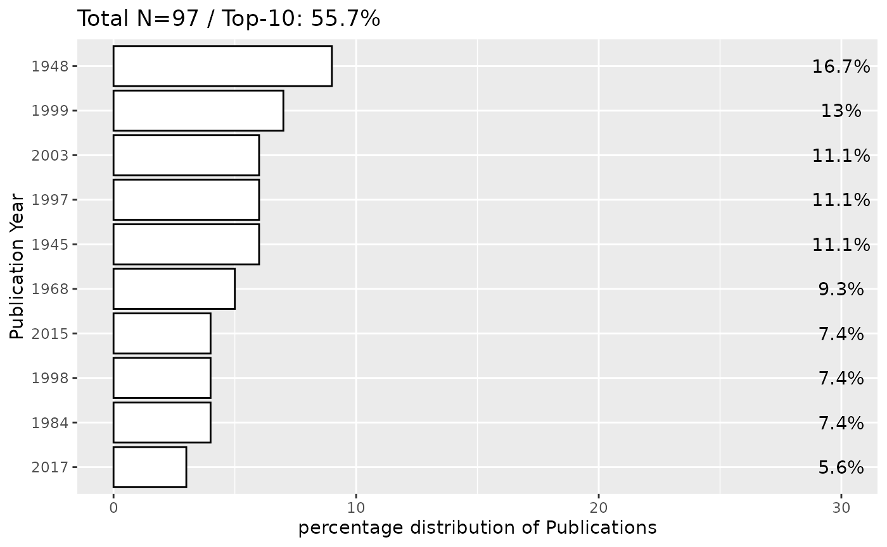

# Refining Finna Metadata

## Introduction

The `refine_metadata` function is designed to clean and standardize
metadata retrieved from the Finna API. This function enhances metadata
usability by:

- **Validating Required Fields:** Ensures the presence of specified
  metadata fields, returning `NULL` if any are missing.
- **Selecting Relevant Fields:** Allows users to specify which metadata
  fields to retain for streamlined analysis.
- **Handling Missing Values (Optional):** If `fill_na = TRUE`, missing
  values (`NA`) are replaced with placeholders.
- **Logging Missing Data (Optional):** If `verbose = TRUE`, prints a
  summary of missing values to assist in data quality assessment.

This preprocessing step ensures metadata consistency, improving its
reliability for subsequent analysis and visualization.

### Example Usage

``` r
library(finna)
library(ggplot2)

# Retrieve metadata from Finna API
sibelius_data <- search_finna("sibelius")

# Refine metadata and display missing data summary
refined_data <- refine_metadata(sibelius_data)
print(refined_data)
```

    ## # A tibble: 100 × 8
    ##    Title                   Author Year  Language Formats Subjects Library Series
    ##    <chr>                   <chr>  <chr> <chr>    <chr>   <chr>    <chr>   <chr> 
    ##  1 Sibelius favourites : … Sibel… 2001  NA       Äänite… NA       Lapin … NA    
    ##  2 SIBELIUS                TAWAS… 1997  fin      Kirja,… SIBELIUS Anders… NA    
    ##  3 Sibelius                Tawas… 1997  fin      Kirja,… Sibeliu… Kansal… NA    
    ##  4 Sibelius                Tawas… 2003  fin      Kirja,… Sibeliu… Blanka… NA    
    ##  5 Sibelius                Downe… 1945  fin      Kirja,… Sibeliu… Heili-… NA    
    ##  6 Sibelius                Tawas… 1968  swe      Kirja,… Sibeliu… Anders… NA    
    ##  7 SIBELIUS                RINGB… 1948  swe      Kirja,… SIBELIU… Helle-… NA    
    ##  8 SIBELIUS                TAWAS… 1968  swe      Kirja,… SIBELIU… Helle-… NA    
    ##  9 Sibelius                Gray,… 1934  eng      Kirja,… Sibeliu… PIKI-k… NA    
    ## 10 Sibelius                Gray,… 1945  eng      Kirja,… Sibeliu… Vanamo… NA    
    ## # ℹ 90 more rows

### Visualizing Metadata Distribution

The [`top_plot()`](../reference/top_plot.md) function can be used to
visualize key metadata distributions, such as author frequency and
yearly publication distribution.

#### **Author Distribution Analysis**

``` r
# Retrieve and refine metadata
sibelius_data <- search_finna("sibelius")
refined_data <- refine_metadata(sibelius_data)

# Plot top 10 authors with frequency percentages
top_plot(refined_data$Author, field = "Author", ntop = 10, show.percentage = TRUE) +
    xlab("Author") +  
    ylab("Percentage")
```


#### **Yearly Publication Distribution**

``` r
library(finna)

# Retrieve and refine metadata
sibelius_data <- search_finna("sibelius")
refined_data <- refine_metadata(sibelius_data)

# Plot publication year distribution
top_plot(refined_data$Year, field = "Year", ntop = 10, show.percentage = TRUE) +
  xlab("Publication Year") +  
  ylab("percentage distribution of Publications")
```



This vignette demonstrates how
[`refine_metadata()`](../reference/refine_metadata.md) improves metadata
usability, facilitating effective analysis and visualization using the
[`top_plot()`](../reference/top_plot.md) function.
